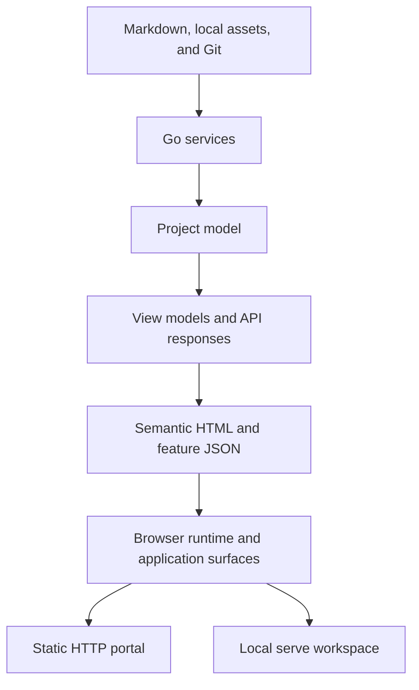
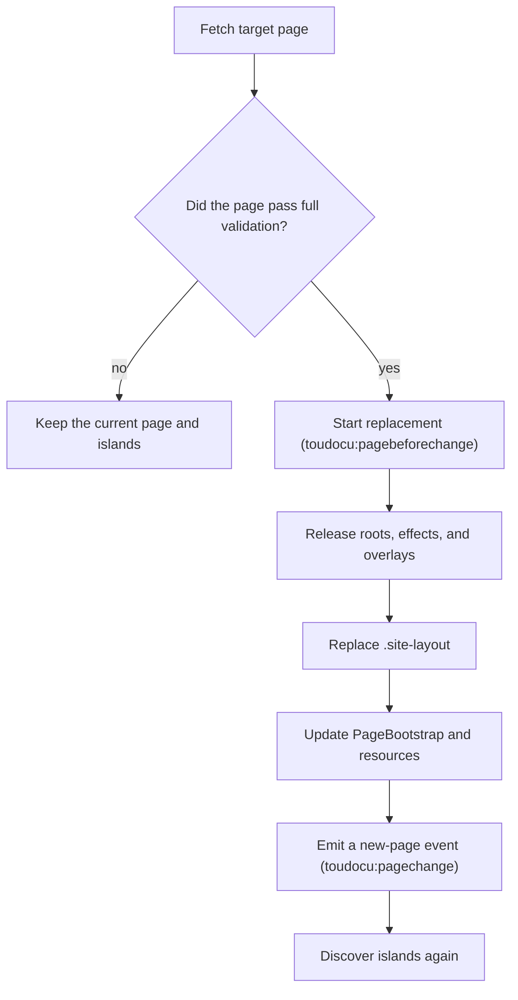

<!-- toudocu
architectureQuestion: Что делает Go-часть, а что — код в браузере?
-->

# Boundary Between Go and the Browser

The Go core owns the documentation and application models and decides about
the filesystem, Git, security, and verification execution. Go presentation
code creates semantic HTML and view models. The browser receives prepared page
data and only the capabilities that Go explicitly enables for its current mode.

React and Base UI provide the UI foundation, and Vite 8 packages browser
assets. [ADR-008](../decisions/ADR-008.md) records the boundary of this
architecture.

## Data flow

## Go responsibilities

The Go core reads and classifies documents, calculates relationships and task
readiness, compares changes, checks paths and write permission, and creates
page data and API responses. Go presentation code turns prepared data into safe
HTML, static JSON files, and browser bootstrap data. A business decision first
appears in the model—such as `capabilities.review`—and only then affects
rendering. The presence of a DOM element does not authorize an operation.

Some presentation code physically lives in `internal/app` and some in
`internal/site`. The logical boundary does not require moving it into new Go
packages.

Every page receives a small JSON bootstrap block. It includes the schema
version, mode (`static` or `serve`), page type, relative resource paths, and
the list of allowed capabilities. It contains no absolute filesystem paths.

## Frontend responsibilities

The browser handles rendering: search over the prepared index, themes, local
state, tabs, dialogs, Mermaid, the editor, and the Changes interface. It does
not parse Markdown, classify documents, calculate relationships, task readiness
or Git diffs, or decide whether a file may be written.

React is used in two places: the page-level Editor and Changes roots, and
islands in canonical `serve`. React owns the DOM only inside an assigned root.
`appearance.ts`, `portal.ts`, `serve.ts`, the screen map, playable flow, and API
Docs remain framework-free. Portal does not become an SPA, and soft navigation
remains browser infrastructure rather than React routing.

In Changes, React manages the range, filters, file tree, detail shell, and the
shared Discussions panel. Git, rendered, and semantic diffs remain projections
prepared by Go; CodeMirror and Mermaid are thin adapters with required cleanup.
When the repository changes, the open detail is not replaced automatically: the
user refreshes it explicitly after the notification.

An island receives permissions and endpoints from `PageBootstrap v1`. Its mount
point holds only the instance identifier and a reference to a safely created,
immutable Go view model. An island failure does not hide Go-generated content
or interrupt other islands or navigation.

For a discussion, the browser sends the target in the canonical document,
selected text or range, and the message. Go checks the path, extracts source
text with context, and finds its new position after the file changes. The
browser does not create a delivery record itself: Go atomically stores the
message and pending delivery, and decides whether the message remains editable.

TypeScript and CSS sources are in `web/`, checked with TypeScript strict mode,
and packaged by Vite 8. A separate packager reads the Vite manifest, calculates
the resource closure for `static` and `serve`, adds pinned third-party assets,
and creates the Toudocu manifest with SHA-256. Node.js remains a development
and build tool only. Server shells live in embedded `html/template` files in
`internal/site/templates/`. Both layers read the same text catalogs in
`internal/site/i18n/{en,ru}.json`; markup is forbidden in catalog values.
Templates define page and workspace shells, while small server components are
assembled by Go from checked fragments with explicit HTML escaping.

Packaged browser assets are stored in `internal/site/assets/generated/` and
embedded in the binary. Browser catalogs are included in the JavaScript assets,
so the static portal needs neither requests to Go nor a separate localization
server. Node.js is needed only for frontend development; the ready binary and
ordinary Go build do not need it.

## How `build` and `serve` differ

`build` creates a read-only multi-page portal. It does not need a running Go
process after the build. It contains no editor, local API, rebuild address, or
way to write a file.

`serve` uses the same pages, but Go explicitly includes extra editor and
Changes assets and passes same-origin API addresses. The `updateCheck`
capability permits the browser to call only the local version-check address;
the server builds the official release URL. The browser does not infer its mode
from the URL or incidental HTML attributes.

Opening content with `file://` is not a supported product path. Use
`toudocu serve` for local viewing; there is no separate `preview` command.

## Island lifecycle

After initial loading, `IslandHost.discover()` mounts eager islands and
registers activated islands. A capability enables a feature but does not itself
load the React bundle.

On a soft navigation, current React roots are removed only after the target
page passes full validation:

`discover()` is idempotent, one instance has at most one React root, and
`unmountAll()` releases all feature-owned resources. An activated island can
load again after a new user action; after an error, an eager island waits for
the next `pagechange`.

Discussions activate on the first opening of the panel or an action on selected
text. Before that, no React/Base UI dynamic chunk is requested. After first
activation, the marker is kept only in `sessionStorage`: the next full or soft
navigation in the same tab restores the island to update its counter and
responses, but does not open the panel. Components release polling, requests,
handlers, and React portals through the shared `AbortSignal` before replacement.

Roadmap uses an eager island only for canonical `roadmap.md` in `serve`. Go
creates an empty mount point next to the button, and React/Base UI owns the
form and dialog. Each time it opens, the island reads allowed stages again and
sends the unchanged `expectedDigest` and `roadmap-add`; the server remains the
owner of validation and the focused Markdown edit.

Editor uses a separate page-level React root inside a Go-generated shell. React
owns the file tree, action bar, tabs, conflicts, diagnostics, notices, and the
Base UI creation dialog. Its component creates CodeMirror for the selected
file, passes it diagnostics and theme, and calls `destroy()` when the file
changes or the root unmounts; document, selection, viewport, and transactions
remain CodeMirror's internal state. Saving, creation, and preview still go
through the Editor HTTP API, which checks the path, action header, and SHA-256
CAS on the server.

<!-- toudocu:section invariants -->
## Invariants

- The HTML of a regular page contains the main Markdown content before
  JavaScript starts.
- The documentation and application model contains no HTML, CSS classes, or
  browser-specific markup.
- React does not own Portal routing, `PageBootstrap`, or security decisions and
  does not reconstruct domain semantics from a view model.
- Useful Go-generated content is outside React roots.
- `appearance.js` runs before the first CSS file in the portal, editor, and
  Changes so the selected theme does not flash on load.
- Shared typography roles are `body`, `interface`, `heading`, and `mono`; code
  and diffs use `mono`, document text uses `body`.
- Static JSON files are created from the same model as HTML.
- Server HTML and browser state use one interface catalog; the catalog contains
  text only, while templates and presentation code define structure.
- The portal works at the host root and at a nested URL path without a required
  `baseURL`.
- Embedded resource names are reproducible and contain no time or random data.
- A failure in one interactive element does not hide document text.
- A failed version check does not change page content or make the browser call
  an external site.
- Every browser input is untrusted; Go makes security decisions.
- The `review` capability exists only in the main `serve`, not in static or
  translated portals.

## Related documents

- [ADR-008: React islands and Vite without turning Portal into an SPA](../decisions/ADR-008.md)
- [How do runtime components divide responsibilities?](runtime-components.md)
- [Where are the trust boundaries?](trust-boundaries.md)
- [MOD-SITE: Static portal](../modules/site.md)
- [UC-DOCS-01: Create a static HTTP portal](../use-cases/build-portal.md)
- [FLOW-DOCS-BUILD: Build a static HTTP portal](../flows/FLOW-DOCS-BUILD.md)
