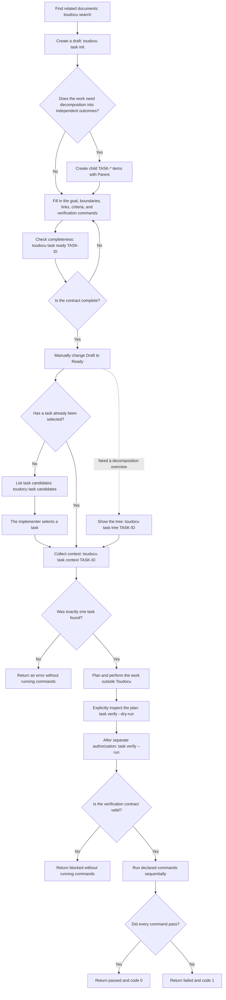

<!-- toudocu
id: FLOW-TASK-WORKFLOW
module: MOD-CLI
useCase: UC-TASK-01, UC-TASK-02, UC-TASK-03
updated: 2026-08-23
-->

# FLOW-TASK-WORKFLOW: Work with a verifiable task

The diagram connects task preparation, safe context collection, and a separate,
explicitly authorized verification run.

## Process

## Important behavior

- `task context`, `task ready`, `task candidates`, and `task verify --dry-run`
  neither execute system commands nor change Markdown.
- `task candidates` computes contract completeness and dependency completion
  but does not choose the next task.
- `task verify --run` starts only after explicit authorization and runs only the
  trusted commands written in the selected task; it does not run child-task
  commands.
- One failed command does not hide the results of the others; a timeout stops
  that command's entire process tree.
- A person or agent—not Toudocu—judges the request's meaning, whether the links
  are appropriate, and whether acceptance criteria are satisfied.

## Related documents

- [UC-TASK-01: Get work task context](../use-cases/task-workflow.md)
- [UC-TASK-02: Perform work task checks](../use-cases/task-verify.md)
- [UC-TASK-03: Prepare a new work task](../use-cases/UC-TASK-03.md)
- [MOD-CLI: CLI and work-item operations](../modules/cli.md)
- [Work-item guide](../guides/work-items.md)
- [CLI contract](../contracts/cli.md)
