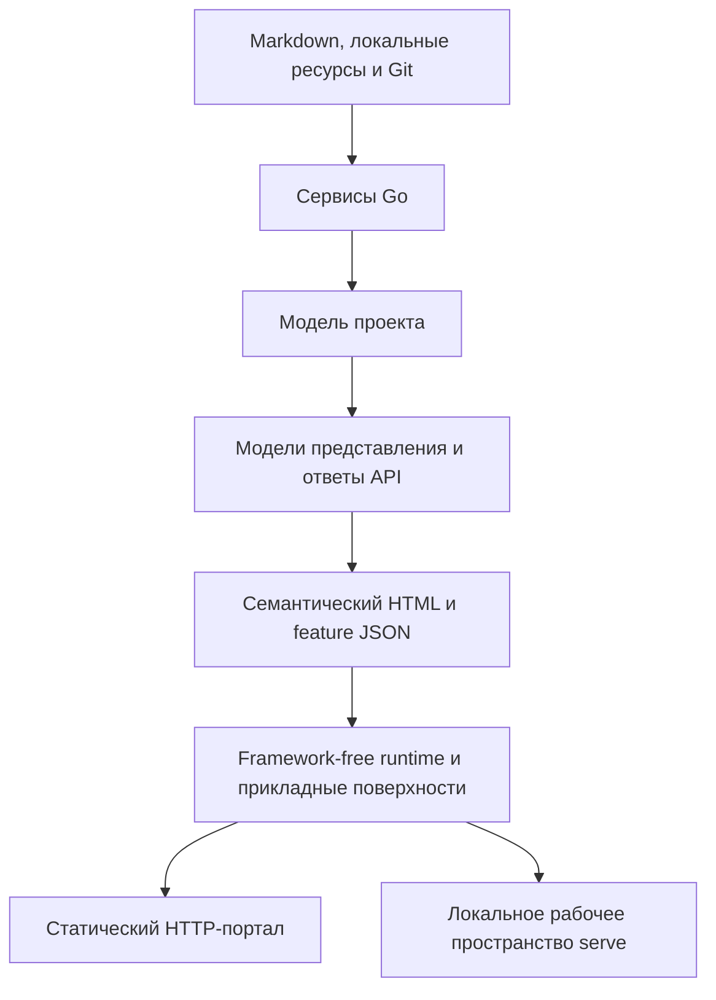
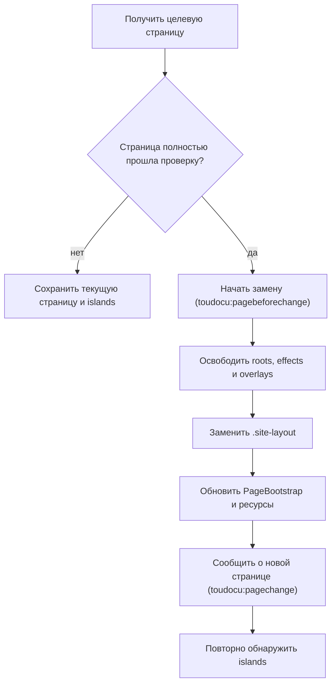

<!-- toudocu
architectureQuestion: Что делает Go-часть, а что — код в браузере?
-->

# Граница между Go и браузером

Go Core владеет документационной и прикладной моделью и принимает решения о
файловой системе, Git, безопасности и запуске проверок. Go presentation code
создаёт semantic HTML и модели представления. Браузер получает готовые данные
страницы и только те возможности, которые Go явно включил для текущего режима.

React, Base UI и Vite приняты как целевой фундамент миграции, но ещё не
внедрены. [ADR-008](../decisions/ADR-008.md) фиксирует границы целевого
состояния; этот документ различает их с действующей реализацией.

## Поток данных

## Что делает Go

Go Core читает и классифицирует документы, вычисляет связи и готовность задач,
сравнивает изменения, проверяет пути и допустимость записи, создаёт данные
страниц и ответы API. Go presentation code преобразует подготовленные данные в
безопасный HTML, статические JSON-файлы и browser bootstrap. Бизнес-решение
сначала появляется в модели — например, `capabilities.review`, — и только затем
влияет на отображение. Наличие DOM-элемента не разрешает операцию.

Часть presentation code сейчас физически находится в `internal/app`, а часть —
в `internal/site`. UI-миграция не переносит её в новые Go-пакеты: логическая
граница не требует немедленного изменения структуры реализации.

Каждая страница получает небольшой JSON-блок запуска. В нём есть версия схемы,
режим (`static` или `serve`), тип страницы, относительные пути к ресурсам и
список разрешённых возможностей. Абсолютные пути файловой системы туда не
попадают.

## Что делает браузер

Браузер отвечает за отображение: поиск по готовому индексу, темы, локальное
состояние, вкладки, диалоги, Mermaid, редактор и интерфейс изменений. Он не разбирает
Markdown, не классифицирует документы, не вычисляет связи, готовность задачи
или Git diff и не решает, можно ли записать файл.

Целевое состояние разрешает React в двух местах: page-level roots Editor и
Changes и islands внутри канонического `serve`. React владеет DOM только внутри
выделенного root. `appearance.ts`, `portal.ts`, `serve.ts`, текущие screen map,
playable flow и API Docs остаются framework-free. Portal не становится SPA, а
soft navigation остаётся browser infrastructure, а не React routing.

Island получает разрешения и endpoints из `PageBootstrap v1`. Его mount point
содержит только идентификатор instance и ссылку на безопасно созданную Go
неизменяемую view model. Ошибка island не скрывает Go-generated содержимое и не
мешает другим islands или навигации.

Для обсуждения браузер передаёт цель в каноническом документе, выделенный
текст или диапазон и сообщение. Go проверяет путь, извлекает исходный текст с
контекстом и определяет новое положение после изменения файла. Браузер не
создаёт запись очереди сам: Go атомарно сохраняет сообщение и ожидающую запись,
а также решает, доступно ли сообщение для редактирования.

Сейчас исходники TypeScript и CSS находятся в `web/`, проверяются в строгом
режиме TypeScript и собираются esbuild. Целевая миграция заменяет сборщик на
Vite 8, но не добавляет Node.js в production runtime. Серверные оболочки находятся во встроенных
`html/template`-шаблонах `internal/site/templates/`. Оба слоя читают
одинаковые текстовые каталоги `internal/site/i18n/{en,ru}.json`; разметка в
значениях каталога запрещена. Шаблоны задают оболочки страниц и рабочих
поверхностей, а небольшие серверные компоненты Go собирает из проверенных
фрагментов с явным HTML-экранированием.

Собранные браузерные ресурсы хранятся в
`internal/site/assets/generated/` и встраиваются в бинарник. При сборке
браузерные каталоги включаются в JS-ресурсы, поэтому статическому порталу не
нужны запросы к Go или отдельный сервер локализации. Node.js нужен только при
разработке интерфейса; готовому бинарнику и обычной сборке Go он не нужен.

## Чем отличаются `build` и `serve`

`build` создаёт многостраничный портал только для чтения. После сборки ему не
нужен запущенный Go-процесс. В нём нет редактора, локального API, адреса
пересборки и возможности записать файл.

`serve` использует те же страницы, но Go явно включает дополнительные ресурсы
редактора и изменений и передаёт same-origin адреса API. Возможность
`updateCheck` разрешает браузеру обратиться только к локальному адресу проверки
версии; официальный URL релиза строит сервер. Браузер не угадывает режим по URL
или случайным HTML-атрибутам.

Прямое открытие через `file://` не поддерживается как продуктовый путь. Для
локального просмотра существует `toudocu serve`; отдельной команды `preview`
нет.

## Жизненный цикл islands

После начальной загрузки `IslandHost.discover()` монтирует eager islands и
регистрирует activated islands. Наличие capability разрешает feature, но само
по себе не загружает React bundle.

При мягком переходе текущие React roots удаляются только после полной проверки
целевой страницы:

`discover()` идемпотентен, один instance имеет не более одного React root, а
`unmountAll()` освобождает все принадлежащие feature ресурсы. Activated island
можно повторно загрузить после нового действия пользователя; eager island после
ошибки ждёт следующего `pagechange`.

<!-- toudocu:section invariants -->
## Инварианты

- Основной текст Markdown уже находится в HTML до запуска JavaScript.
- Документационная и прикладная модель не содержит HTML, CSS-классов и
  browser-specific разметки.
- React не владеет маршрутизацией Portal, `PageBootstrap` или решениями
  безопасности и не реконструирует domain semantics из view model.
- Полезное Go-generated содержимое находится вне React roots.
- `appearance.js` применяется до первого CSS-файла в портале, редакторе и
  изменениях, чтобы выбранная тема не мигала при загрузке.
- Общие роли шрифтов — `body`, `interface`, `heading` и `mono`; код и diff
  используют `mono`, текст документа — `body`.
- Статические JSON-файлы создаются из той же модели, что и HTML.
- Серверный HTML и браузерные состояния используют один каталог интерфейса;
  каталог содержит только текст, а структуру задают шаблоны и код
  представлений.
- Портал работает и в корне HTTP-хоста, и во вложенном URL без обязательного
  `baseURL`.
- Имена встроенных ресурсов воспроизводимы и не содержат времени или случайных
  данных.
- Ошибка отдельного интерактивного элемента не скрывает текст документа.
- Ошибка проверки версии не меняет содержимое страницы и не заставляет браузер
  обращаться к внешнему сайту.
- Любой ввод браузера считается недоверенным; решения безопасности принимает
  Go.
- Возможность `review` есть только у основного `serve`, но не у статического и
  переводного порталов.

## Связанные документы

- [ADR-008: React-острова и Vite без превращения Portal в SPA](../decisions/ADR-008.md)
- [Как компоненты делят ответственность?](runtime-components.md)
- [Границы доверия](trust-boundaries.md)
- [MOD-SITE: Статический портал](../modules/site.md)
- [UC-DOCS-01: Создать статический HTTP-портал](../use-cases/build-portal.md)
- [FLOW-DOCS-BUILD](../flows/FLOW-DOCS-BUILD.md)
