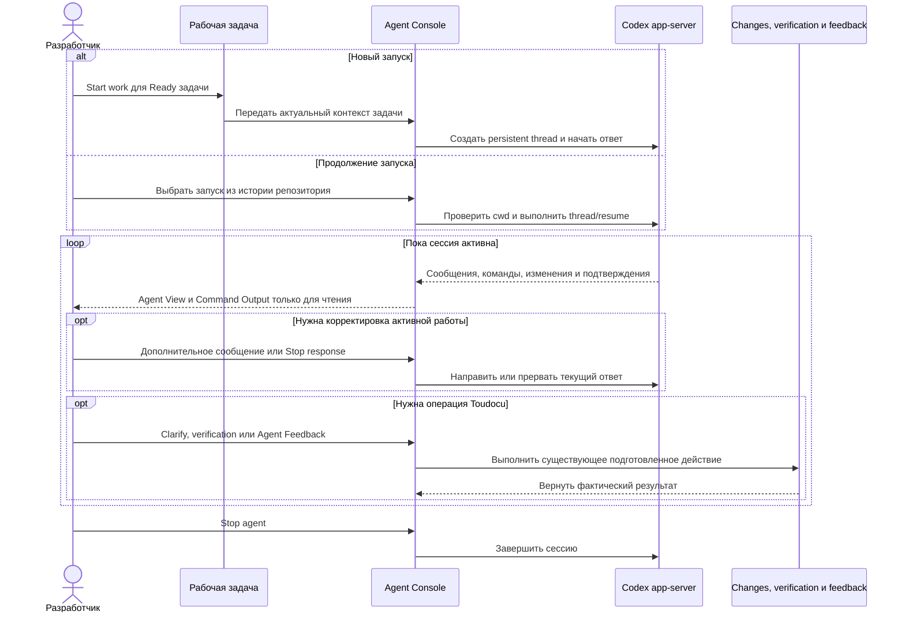

<!-- toudocu
id: FLOW-AGENT-CONSOLE
module: MOD-AGENT-CONSOLE
useCase: UC-AGENT-CONSOLE-01
updated: 2026-08-25
-->

# FLOW-AGENT-CONSOLE: Работа с coding agent

## Процесс

## Важные условия

- Agent Console не копирует состояние задачи, Changes, verification или Agent
  Feedback.
- Command Output коррелируется с карточкой команды по стабильному идентификатору
  и не является terminal emulator.
- Навигация меняет текущий контекст интерфейса, но не Agent Session.
- Историей threads и их транскриптами владеет Codex; Console только выводит
  список для текущего корня репозитория и запускает нативный resume.
- Approval, interrupt и stop не выводятся из текста команды.

## Связанные документы

- [UC-AGENT-CONSOLE-01](../use-cases/UC-AGENT-CONSOLE-01.md)
- [MOD-AGENT-CONSOLE](../modules/MOD-AGENT-CONSOLE.md)
- [контракт Agent Console](../contracts/agent-console.md)
